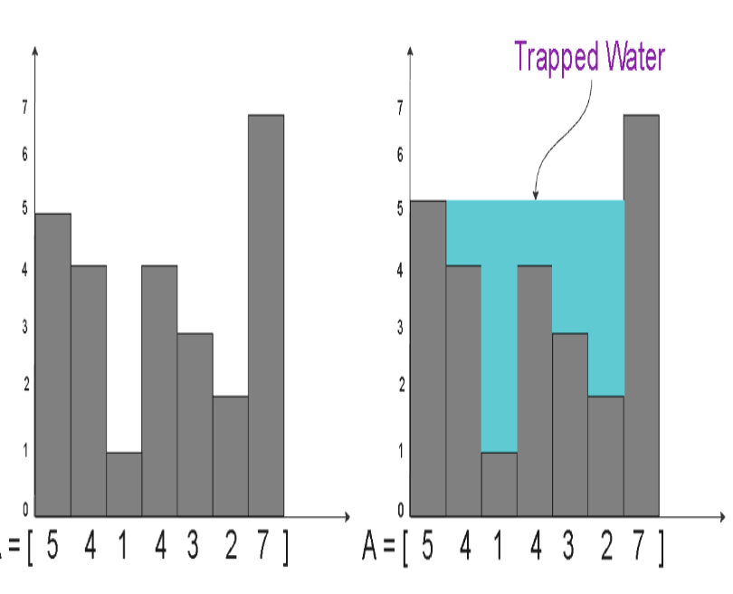

### Imagine a histogram where the bars' heights are given by the array A. Each bar is of uniform width, which is 1 unit. When it rains, water will accumulate in the valleys between the bars.

### Your task is to calculate the total amount of water that can be trapped in these valleys.

#### Example:
The Array A = [5, 4, 1, 4, 3, 2, 7] is visualized as below. The total amount of rain water trapped in A is 11.

#### Problem Constraints

1 <= |A| <= 105
0 <= A[i] <= 105

#### Input Format

First and only argument is the Integer Array, A.

### Output Format

Return an Integer, denoting the total amount of water that can be trapped in these valleys